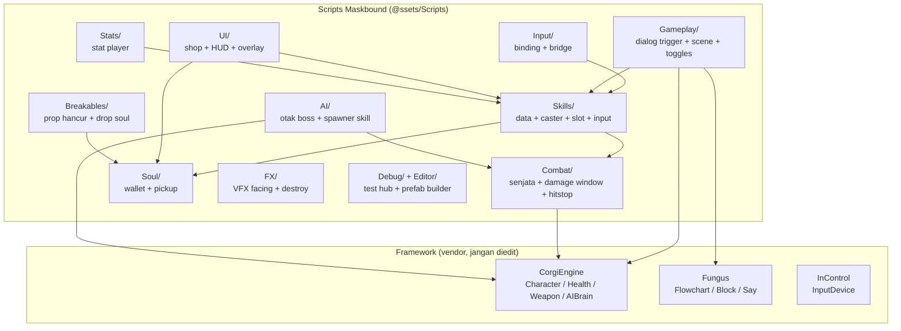
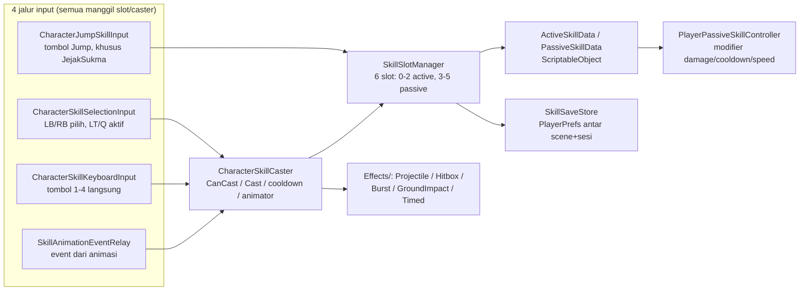
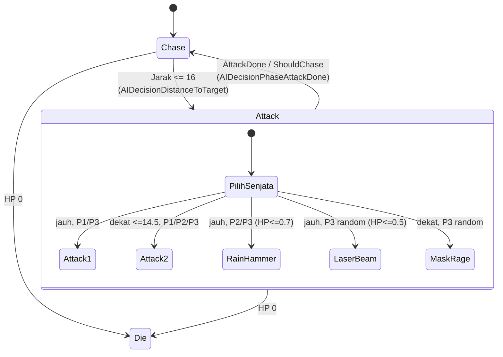
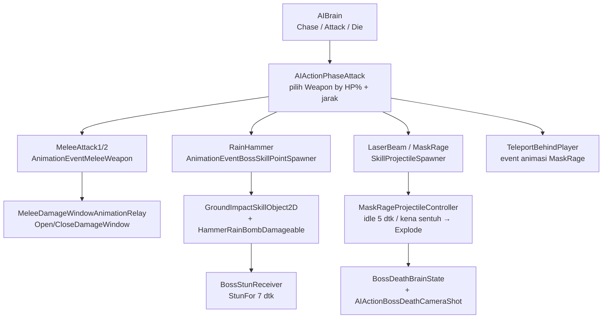
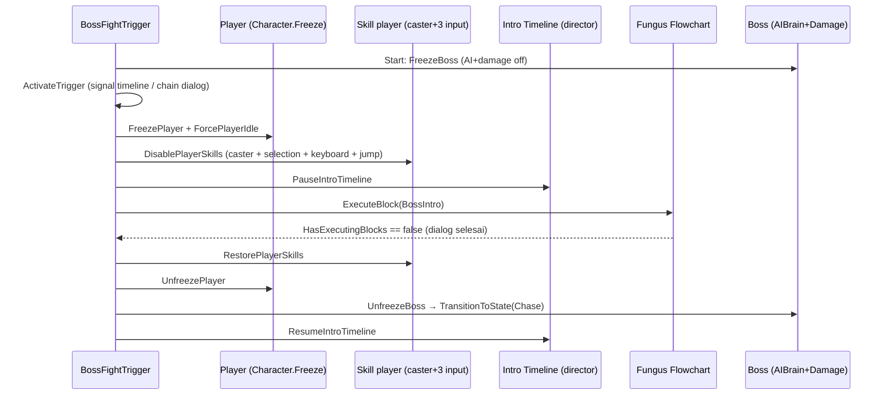
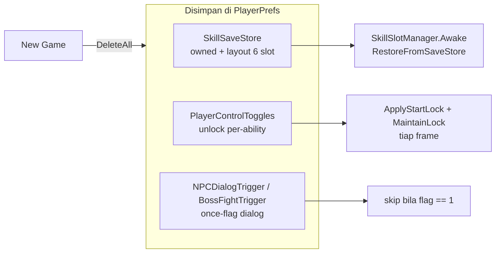

# Peta Script Gameplay — Maskbound Jinosi

> Sumber: hasil scan langsung `Assets/@ssets/Scripts/` (~141 file, 12 folder).
> Baseline: Unity `6000.3.16f1`, URP `17.3.0`, Cinemachine `3.1.2`, Timeline `1.8.12`, CorgiEngine + Fungus + InControl. Tanpa `.asmdef` (satu assembly `Assembly-CSharp`).

Prinsip proyek ini (dari `Docs/README.md`):

```text
Corgi Engine mengurus platformer, Maskbound mengurus aturan game.
```

---

## 1. Diagram Modul Besar



---

## 2. Alur Skill Player (4 jalur input → 1 caster)



Catatan penting:

- Boss **tidak** lewat jalur ini. Boss pakai Corgi `Weapon` + Animation Event (lihat §3).
- Disable skill player = matikan **4 komponen**: `CharacterSkillCaster` + 3 input (`Selection`, `Keyboard`, `Jump`). Lihat `PlayerControlToggles.DisableSkills()` dan `BossFightTrigger.DisablePlayerSkills()` — keduanya harus sinkron.

---

## 3. AI Boss PrabuKlana (state + pemilih senjata)





---

## 4. Sequence Dialog Intro Boss (skill mati selama dialog saja)



---

## 5. Persistensi (PlayerPrefs)



---

## 6. Isi Tiap Folder (file → peran satu baris)

### 6.1 `AI/` — 13 file, otak + alat cast boss

| File | Peran |
|---|---|
| `AIActionPhaseAttack.cs` | Otak utama: pilih Weapon by HP% + jarak |
| `AIDecisionPhaseAttackDone.cs` | Syarat keluar state Attack |
| `AIActionMoveToBossSkillPoint.cs` + `AIDecisionBossSkillPointReached.cs` | Navigasi ke skill point (cadangan, tidak dipakai di state aktif) |
| `AIActionCallDialogTrigger.cs` | AI memanggil dialog trigger lain |
| `AIActionToggleDamageOnTouch.cs` | Nyalakan/matikan damage dari AI state |
| `AnimationEventBossSkillPointSpawner.cs` | Cast RainHammer dari animation event |
| `AnimationEventTeleportBehindPlayer.cs` | Teleport MaskRage ke belakang player |
| `BossSkillSpawnPointGroup.cs` | Registry 5 titik spawn `prabu_klana_skill` |
| `BossSkillPointGroupFacingMirror.cs` | Mirror spawn point saat boss balik arah |
| `BossStunReceiver.cs` | Terima weakness dari bom → stun AI |
| `BossDeathBrainState.cs` | Paksa transisi ke state Die |
| `AIActionBossDeathCameraShot.cs` | Sinematik mati + kembali ke menu |

### 6.2 `Skills/` — 20 file inti + `Effects/` (12) + `Passives/` (6)

| File | Peran |
|---|---|
| `Skill.cs` / `SkillType.cs` | Base ScriptableObject + enum Active/Passive |
| `ActiveSkillData.cs` | Data skill aktif (prefab, cooldown, SFX, flag Jump-button) |
| `PassiveSkillData.cs` + `PassiveEffectData.cs` | Data pasif + efeknya |
| `SkillSlot.cs` / `SkillSlotManager.cs` | 1 slot + manager 6 slot (equip/unequip/activate) |
| `SkillContext.cs` / `SkillRuntimeContext.cs` / `ISkillRuntimeReceiver.cs` | Konteks equip + konteks runtime untuk efek |
| `CharacterSkillCaster.cs` | Cast, cooldown global, kunci gerakan, animator |
| `CharacterSkillSelectionInput.cs` | Pilih via LB/RB, aktif via LT/Q |
| `CharacterSkillKeyboardInput.cs` | Aktif langsung via 1-4 (sekarang disabled di prefab) |
| `CharacterJumpSkillInput.cs` | Cast via tombol Jump (JejakSukma) |
| `SkillAnimationEventRelay.cs` | Jembatan animation event → caster |
| `SkillSaveStore.cs` | Save/load owned + layout slot |
| `SkillCooldownFeedback.cs` / `SkillSelectionIconFeedback.cs` / `SkillIconFloatingPopup.cs` / `CooldownFloatingText.cs` | Feedback cooldown + seleksi |
| `PlaceholderActiveSkill.cs` / `PlaceholderPassiveSkill.cs` | Skill dummy untuk tes/dev |

`Effects/` (12): `SkillProjectile2D`, `SkillHitbox2D`, `SkillBurstSpawner2D`, `SkillProjectileSpawner`, `SkillSummonObject`, `TimedSkillObject`, `GroundImpactSkillObject2D` (+AnimationRelay), `HammerRainBombDamageable`, `MaskRageProjectileController`, `JejakSukmaJumpEffect`, `AnimationEventVFXSpawner` — semua pelaku efek yang di-spawn caster/boss.

`Passives/` (6): `PlayerPassiveSkillController` (orkestrasi modifier), `ConsecutiveHitPassiveEffect`, `HealOnHitPassiveEffect`, `StatModifierPassiveEffect`.

### 6.3 `Combat/` — 18 file, senjata + damage

| Kelompok | File |
|---|---|
| Base & relay boss | `AnimationEventMeleeWeapon.cs`, `MeleeDamageWindowAnimationRelay.cs`, `DamageOnTouchAnimationRelay.cs`, `AnimationEventLunge2D.cs` |
| Player | `MaskboundSpecialAttackAbility.cs` + `MaskboundSpecialAttackData.cs` + `MaskboundSpecialHitbox.cs`, `CharacterBlock.cs`, `CharacterMeditation.cs`, `SingleAirAttackLimiter.cs`, `WeaponFacingTransformSync.cs` |
| Feedback | `HitstopTrigger.cs`, `MeleeWeaponHitstop.cs`, `DamageNumberManager.cs` + `DamageNumberPopup.cs`, `FaceDamageDirectionOnHit.cs` |
| Debug | `MaskboundMeleeWeaponStateDebug.cs`, `MaskboundWeaponDirectInputDebug.cs` |

### 6.4 `Gameplay/` — 20 file

- `Dialogue/` (5): `BossFightTrigger.cs` (intro + freeze + dialog + start fight), `NPCDialogTrigger.cs` (dialog NPC + once-flag + chain), `FungusPlayAnimation.cs`, `GameOverFungusBridge.cs`, `TutorialViews.cs`
- `Scene/` (7): `GameFlowManager.cs`, `BootstrapSceneLoader.cs`, `FountainInteractable.cs` (buka shop), `MapTransitionDoor.cs` (pintu antar scene), `SpiritualSoulTarget.cs`, `SceneBgmManager.cs`, `PlayerGameOverOverlayController.cs`
- Root (8): `PlayerControlToggles.cs` (toggle per-ability + tutorial lock + context-menu tes), `LandingMovementLock.cs`, `LocomotionAnimationSpeedSync.cs`, `MaskboundLandingAnimatorTrigger.cs`, `CharacterFacingVisualOffset.cs`, `PlayerDeathKnockback.cs`, `HitstopBootstrap.cs`, `DemoBossChallengeTimer.cs`

### 6.5 `UI/` — 20 file

| File | Peran |
|---|---|
| `SkillShopPanel.cs` | Shop buy/equip (polling F/A di Update, belum onClick) |
| `SkillCooldownSlotUI.cs` | Tampilan slot + cooldown (display only) |
| `BossHealthTarget.cs` + `BossHealthUIBinder.cs` | Data nama boss + binder bar HP |
| `BossVictoryOverlay.cs` / `GameOverOverlay.cs` / `OverlayConfirmInput.cs` | Overlay menang/mati + konfirmasi input |
| `HealthProgressBarDisplay.cs` / `HealthSpriteStateDisplay.cs` / `HealthTextDisplay.cs` | Tampilan HP (3 varian) |
| `SoulTextDisplay.cs` / `LivesUIBinder.cs` / `InteractionPrompt.cs` | Teks soul, nyawa, prompt interact |
| MainMenu (`MainMenuController`/`Page`/`FolderButton`), `InControlMenuSelectionInput.cs`, `CreditPager.cs`, `TutorialUIOpener.cs`, `InputTutorialTextDisplay.cs` | Menu + tutorial UI |

### 6.6 `Input/` — 6 file

`MaskboundInControlInputManager.cs`, `MaskboundInControlWeaponInput.cs`, `MaskboundInputBindings.cs` (+ `.asset`), `MaskboundBasicAttackInputBridge.cs`, `InControlDuplicateDestroyer.cs`, `MaskboundInputInspectorMonitor.cs` — satu jalur input InControl untuk Player1.

### 6.7 Pendukung — `Soul/` (3), `Stats/` (2), `Breakables/` (4), `FX/` (4)

- `Soul/`: `SoulWallet.cs`, `SoulPickup.cs`, `SoulCurrencyData.cs`
- `Stats/`: `CharacterStats.cs`, `CharacterStatData.cs` (+ `.asset` player default)
- `Breakables/`: `BreakableObject.cs` (base: HP + flash + drop soul acak), `BreakableStoneObject.cs`, `BreakableSoulObject.cs`, `BreakableBurstEffect.cs`
- `FX/`: `FacingSpawnPoint2D.cs`, `SpawnedVFXFacing2D.cs`, `AnimatorIntOnAwake.cs`, `DestroyAfterAnimation.cs`

### 6.8 `Debug/` (9+1) + `Editor/` (2)

`DevTestHub.cs`, DevModMenu (`Controller`/`Page`/`FolderButton`/`ActionButton`/`ToggleItem`), `DevTestPanelController.cs`, `DevTestStatusDisplay.cs`, `EnemyDistanceDebugVisualizer.cs`; Editor: `SkillShopPrefabBuilder.cs` (bangun + wiring prefab shop), `BreakableSaveIdAssigner.cs`, `DevModMenuBootstrapBuilder.cs`, `MainMenuBootstrapBuilder.cs`.

---

## 7. Aturan Arsitektur (dari skill unity-architecture)

- **Tier proyek:** long-lived (bukan prototipe) — 141 file, save antar sesi, banyak sistem saling kunci.
- **Data ownership:** authored config di `ScriptableObject` (`Skills/*.asset`, `Soul_DefaultCurrency`, `Player_DefaultStats`, `MaskboundInputBindings`); runtime state di komponen + `SkillSaveStore`; scene object hanya komposisi.
- **Komunikasi:** direct ref untuk parent→child yang pasti ada; event (`SkillEquipped`, `MMDamageTakenEvent`, `CorgiEngineEvent.LevelStart`) untuk antar sistem; Timeline Signal → public method untuk sinematik; Fungus `Call Method` untuk trigger dari dialog (jangan bikin custom command baru bila built-in cukup).
- **Bootstrap:** player di-spawn runtime oleh LevelManager — semua skrip wajib auto-find + guard `null` + tunggu `AbilityInitialized`, bukan drag-and-drop di Inspector.
- **Risiko performa (hot path):** `MaintainLock()` tiap frame (murah, hanya cek `enabled`), `PlayerPassiveSkillController.Update()` (tick semua runtime), polling input di `Update()` shop/selection — ketiganya O(kecil), aman untuk target PC.
- **Do now / skip now:** pertahankan pola yang ada (atomic `DisableX/EnableX` + wrapper, context-menu Testing, field Inspector opt-in default OFF). Jangan tambah framework/layer baru; jangan pecah asmdef sebelum ada kebutuhan build yang nyata.

## 8. Risiko & Inkonsistensi yang Diketahui

1. Dua jalur disable skill tidak sinkron (`PlayerControlToggles` vs `BossFightTrigger`) — `BossFightTrigger` baru dilengkapi caster (perubahan terakhir).
2. `BuyButton` + entry shop `onClick` kosong — interaksi hanya keyboard/gamepad.
3. Keyboard 1-4 di-disable di prefab tapi kodenya masih hidup — putuskan: hapus atau pertahankan sebagai fallback.
4. Tanpa `.asmdef` — kompilasi melambat seiring file bertambah.

## 9. Unknowns (perlu konfirmasi)

- Apakah 4 jalur input skill memang disengaja dipertahankan semua?
- Scene mana pakai tutorial lock vs hanya `BossFightTrigger`?

## 10. Cara Baca Lanjutan

1. Mau paham shop → `UI/SkillShopPanel.cs` (`TryBuySelected`, `EquipSelectedSkill`, `SelectIndex`).
2. Mau paham cast → `Skills/CharacterSkillCaster.cs` (`CanCast`, `Cast`, `ActivateSkillSlot`).
3. Mau paham boss → `AI/AIActionPhaseAttack.cs` (`PerformPhaseAttack`, `PickRandomPhase3Weapon`).
4. Mau paham intro → `Gameplay/Dialogue/BossFightTrigger.cs` (`ActivateTrigger`, `DisablePlayerSkills`, `PlayDialog`, `EndSequence`).
5. Data skill → `ScriptableObjects/Skills/` (4 active + 6 passive + 7 effect).
